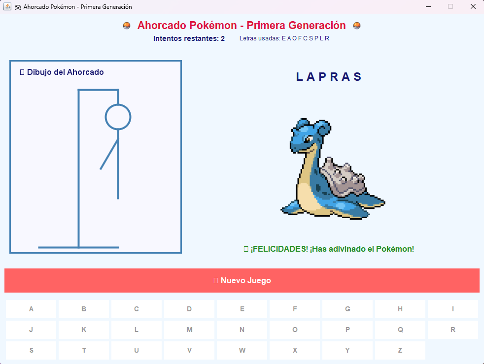

# 🎮 Ahorcado Pokémon - Primera Generación

Un juego del ahorcado clásico implementado en Java que utiliza nombres de Pokémon de la primera generación como palabras a adivinar.

## 🚀 Características

### Versión Consola (`AhorcadoPokemon.java`)
- **Pokémon de la Primera Generación**: Utiliza los 151 Pokémon originales (Bulbasaur hasta Mew)
- **Integración con PokéAPI**: Obtiene nombres de Pokémon en tiempo real desde la API oficial
- **Modo Offline**: Incluye una lista local como respaldo si no hay conexión a internet
- **Interfaz Amigable**: Interfaz de consola intuitiva con emojis y colores
- **Sistema de Intentos**: 6 intentos para adivinar la palabra
- **Validación de Entrada**: Verifica que se ingresen letras válidas
- **Juego Continuo**: Opción de jugar múltiples rondas

### Versión GUI (`AhorcadoPokemonGUI.java`)
- **Interfaz Gráfica Completa**: Ventana moderna con Java Swing
- **Imágenes de Pokémon**: Muestra la imagen oficial del Pokémon al adivinarlo
- **Botones Interactivos**: Panel con botones para cada letra del alfabeto
- **Dibujo Visual del Ahorcado**: Representación gráfica progresiva del ahorcado
- **Colores y Efectos**: Interfaz colorida con feedback visual inmediato
- **Mensajes Dinámicos**: Notificaciones en tiempo real del estado del juego
- **Botón Nuevo Juego**: Reiniciar fácilmente para jugar otra ronda

## 🛠️ Requisitos

- Java 8 o superior
- Conexión a internet (opcional, funciona sin conexión con lista local)

## 📦 Instalación y Ejecución

### Versión Consola
1. **Compilar el programa:**
   ```bash
   javac AhorcadoPokemon.java
   ```

2. **Ejecutar el juego:**
   ```bash
   java AhorcadoPokemon
   ```

### Versión GUI (Recomendada) 🎨
1. **Compilar el programa:**
   ```bash
   javac AhorcadoPokemonGUI.java
   ```

2. **Ejecutar el juego:**
   ```bash
   java AhorcadoPokemonGUI
   ```

### Scripts de Ejecución Rápida
- **Windows**: `ejecutar-gui.bat` (versión GUI) o `ejecutar.bat` (versión consola)
- **Linux/Mac**: `ejecutar-gui.sh` (versión GUI) o `ejecutar.sh` (versión consola)

## 🎯 Cómo Jugar

### Versión Consola
1. El juego seleccionará aleatoriamente un Pokémon de la primera generación
2. Verás la palabra oculta con guiones bajos (`_`) representando las letras
3. Ingresa una letra para adivinar
4. Si la letra está en la palabra, se revelará
5. Si no está, perderás un intento y se dibujará parte del ahorcado
6. Tienes 6 intentos para adivinar la palabra completa
7. ¡Gana adivinando el nombre del Pokémon antes de quedarte sin intentos!

### Versión GUI 🎨
1. **Inicio**: El juego selecciona automáticamente un Pokémon aleatorio
2. **Interfaz**: Ve la palabra oculta en la parte superior derecha
3. **Letras**: Haz clic en los botones de letras para adivinar
4. **Feedback**: Recibe mensajes inmediatos sobre si la letra es correcta
5. **Ahorcado**: Observa el dibujo progresivo en el panel izquierdo
6. **Victoria**: ¡Al adivinar correctamente aparece la imagen del Pokémon!
7. **Nuevo Juego**: Usa el botón "🔄 Nuevo Juego" para jugar otra ronda

## 🔧 Funcionalidades Técnicas

### Integración con PokéAPI
- **URL Base**: `https://pokeapi.co/api/v2/pokemon/`
- **Imágenes**: `https://raw.githubusercontent.com/PokeAPI/sprites/master/sprites/pokemon/`
- **Rango**: Pokémon con ID del 1 al 151 (primera generación)
- **Formato**: Respuesta JSON con información del Pokémon
- **Fallback**: Lista local de 151 nombres si la API no está disponible

### Versión GUI - Características Avanzadas
- **Java Swing**: Interfaz gráfica moderna y responsiva
- **Carga de Imágenes**: Descarga automática de sprites oficiales de Pokémon
- **Redimensionamiento**: Adaptación automática de imágenes a 200x200 píxeles
- **Componentes Interactivos**: Botones deshabilitados después de usar
- **Dibujo Personalizado**: Ahorcado dibujado con Graphics2D y antialiasing
- **Colores Temáticos**: Paleta de colores azul inspirada en Pokémon

### Manejo de Errores
- Conexión a internet fallida
- Respuestas de API inválidas
- Entrada de usuario incorrecta
- Validación de letras repetidas
- Fallback automático a lista local

### Características del Juego
- **Palabras en mayúsculas**: Todos los nombres se convierten a mayúsculas
- **Sin caracteres especiales**: Solo letras del alfabeto inglés
- **Tracking de letras**: Registra letras ya utilizadas
- **Interfaz visual**: Dibujo del ahorcado progresivo
- **Feedback inmediato**: Mensajes de estado en tiempo real

## 📋 Ejemplo de Uso

### Versión Consola
```
🎮 ¡Bienvenido al Ahorcado Pokémon! 🎮
Adivina el nombre del Pokémon de la primera generación
Tienes 6 intentos para adivinar la palabra.
=====================================

==================================================
Palabra: _ _ _ _ _ _ _ _
Intentos restantes: 6
Letras usadas: []
==================================================
Ingresa una letra: A
✅ ¡Correcto! La letra 'A' está en la palabra.

==================================================
Palabra: _ A _ _ _ _ _ _
Intentos restantes: 6
Letras usadas: [A]
==================================================
Ingresa una letra: B
❌ La letra 'B' no está en la palabra.

🎯 Dibujo del ahorcado:
  +---+
  |   |
  O   |
      |
      |
      |
=========
```

### Versión GUI 🎨
La versión GUI ofrece una experiencia visual completa con:
- **Ventana principal** con título "🎮 Ahorcado Pokémon - Primera Generación 🎮"
- **Panel izquierdo**: Dibujo progresivo del ahorcado
- **Panel derecho**: Palabra oculta y área para imagen del Pokémon
- **Panel inferior**: Botones de letras del alfabeto (A-Z)
- **Botón superior**: "🔄 Nuevo Juego" para reiniciar
- **Mensajes dinámicos**: Feedback inmediato sobre cada letra
- **Imagen del Pokémon**: Aparece automáticamente al ganar

## 🎨 Personalización

### Versión Consola
Puedes modificar fácilmente:
- **Número de intentos**: Cambiar `MAX_INTENTOS`
- **Rango de Pokémon**: Modificar `PRIMERA_GENERACION_MAX`
- **Dibujo del ahorcado**: Editar el array `dibujo[]`
- **Mensajes**: Personalizar los textos de la interfaz

### Versión GUI
Personalización avanzada disponible:
- **Colores**: Modificar la paleta de colores (`colorFondo`, `colorBoton`, etc.)
- **Tamaño de ventana**: Cambiar `setSize(900, 700)`
- **Fuentes**: Personalizar `Font` en cada componente
- **Imágenes**: Modificar tamaño de sprites (actualmente 200x200)
- **Layout**: Reorganizar paneles según preferencias
- **Efectos**: Agregar animaciones o transiciones


## 📄 Licencia

Este proyecto es de código abierto y está disponible bajo la licencia MIT.

---


## Captura



¡Disfruta jugando y convirtiéndote en un maestro Pokémon! 🎮✨
